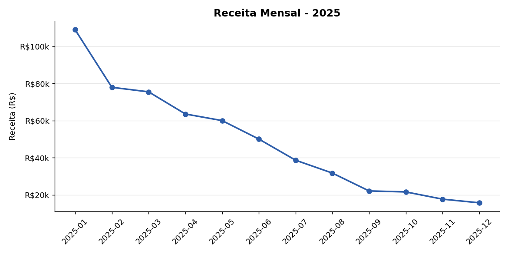
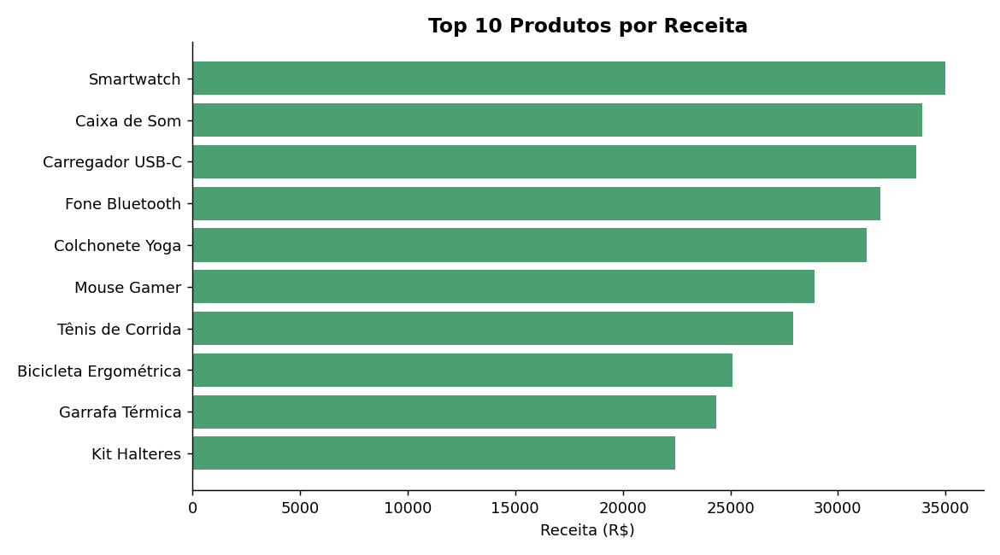
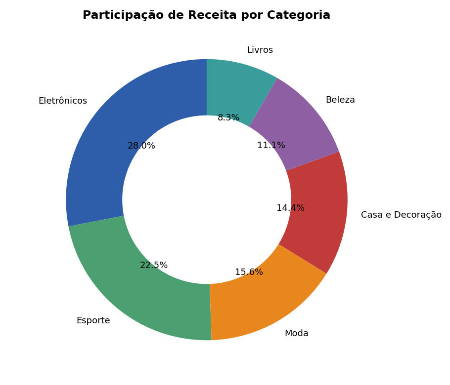
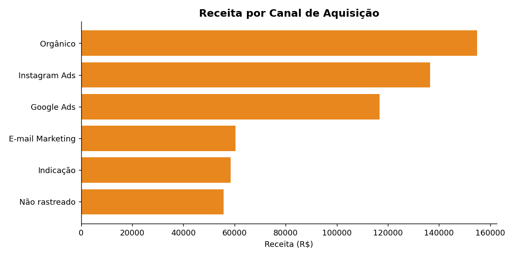
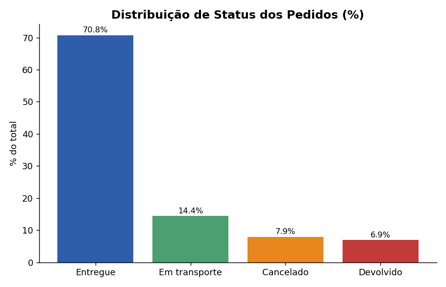

# Análise de Vendas de E-commerce | Python + SQL + Power BI

Projeto de portfólio: análise completa de uma base de vendas de e-commerce, do dado bruto até insights de negócio prontos para um dashboard executivo.

## O problema

A base bruta (`data/vendas_raw.csv`, 5.120 registros) chegou com problemas comuns de dados reais:
- 3 formatos diferentes de data no mesmo arquivo
- Status do pedido escrito de formas diferentes (`Entregue`, `entregue`, `ENTREGUE`)
- 108 linhas duplicadas
- 60 preços nulos e 15 preços negativos (erro de digitação)
- 491 registros sem canal de aquisição rastreado
- Espaços em branco extras em nomes de produto

## O que foi feito

**1. Limpeza e tratamento (Python / pandas)** — [`notebook/02_limpeza_dados.py`](notebook/02_limpeza_dados.py)
- Padronização de datas e status
- Remoção de duplicados
- Imputação de preços nulos pela mediana do produto/categoria
- Criação de colunas derivadas (receita, mês, dia da semana, pedido válido)

**2. Análise (SQL)** — [`sql/analises.sql`](sql/analises.sql)
- Receita mensal e ticket médio
- Top 10 produtos por receita
- Performance por categoria, estado e canal de aquisição
- Taxa de cancelamento/devolução

**3. Visualização** — gráficos abaixo, estruturados para virar um dashboard interativo no Power BI

## Principais insights

- **Receita em queda ao longo do ano**: de R$109k em janeiro para R$16k em dezembro — sinal de sazonalidade forte ou perda de tração que merece investigação.
- **Eletrônicos é a categoria líder** (R$163k, 27% da receita), mas Esporte tem o maior ticket médio por pedido.
- **Tráfego orgânico é o maior canal de receita** (R$155k), à frente de Instagram Ads e Google Ads — oportunidade de revisar o ROI do investimento pago.
- **~15% dos pedidos** são cancelados ou devolvidos — vale investigar se há concentração em algum produto ou canal específico.

## Visualizações

### Receita mensal


### Top 10 produtos por receita


### Participação por categoria


### Receita por canal de aquisição


### Status dos pedidos


## Estrutura do dashboard Power BI

O arquivo `data/vendas_limpo.csv` está pronto para importação direta no Power BI. Estrutura sugerida:

**Página 1 — Visão Executiva**
- Cards de KPI: Receita Total, Ticket Médio, Total de Pedidos, Taxa de Cancelamento
- Gráfico de linha: Receita por mês
- Gráfico de rosca: Receita por categoria

**Página 2 — Produtos e Categorias**
- Tabela/gráfico de barras: Top produtos por receita
- Matriz: Categoria x Mês

**Página 3 — Aquisição e Geografia**
- Mapa do Brasil: Receita por estado
- Gráfico de barras: Performance por canal de aquisição
- Slicers: Categoria, Canal, Status do Pedido, Período

## Stack utilizada

`Python (pandas, numpy)` · `SQL (SQLite)` · `Matplotlib` · `Power BI`

## Estrutura de arquivos

```
├── data/
│   ├── vendas_raw.csv          # dado bruto (com problemas)
│   ├── vendas_limpo.csv        # dado tratado (pronto para Power BI)
│   └── *.csv                   # resultados das queries SQL
├── notebook/
│   ├── 01_gerar_dataset.py
│   ├── 02_limpeza_dados.py
│   ├── 03_analise_sql.py
│   └── 04_graficos.py
├── sql/
│   └── analises.sql
└── charts/
    └── *.png
```

## Dashboard Interativo

🔗 [Ver dashboard completo no Power BI]((https://app.powerbi.com/view?r=eyJrIjoiYzk1ZThmNzMtNDQxMC00Y2FmLTlmMzItZDA2NjA1YjNlZTY4IiwidCI6ImIxMDUxYzRiLTNiOTQtNDFhYi05NDQxLWU3M2E3MjM0MmZkZCJ9))

---
*Projeto de portfólio desenvolvido para demonstrar habilidades em tratamento de dados, SQL e construção de dashboards. Disponível para projetos freelance de análise de dados.*
